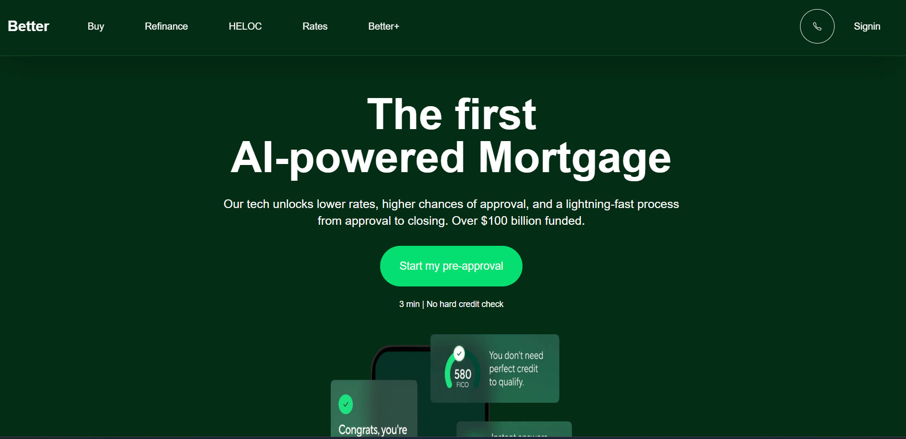
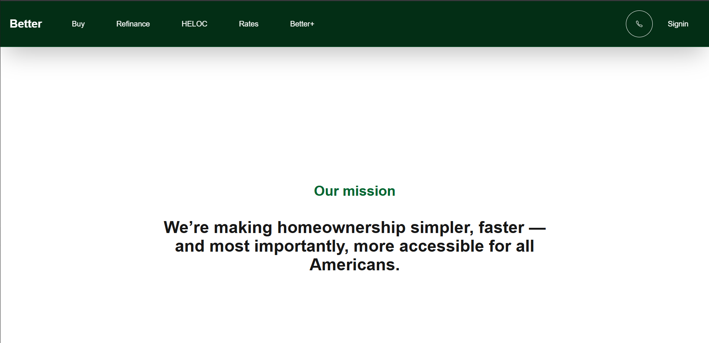
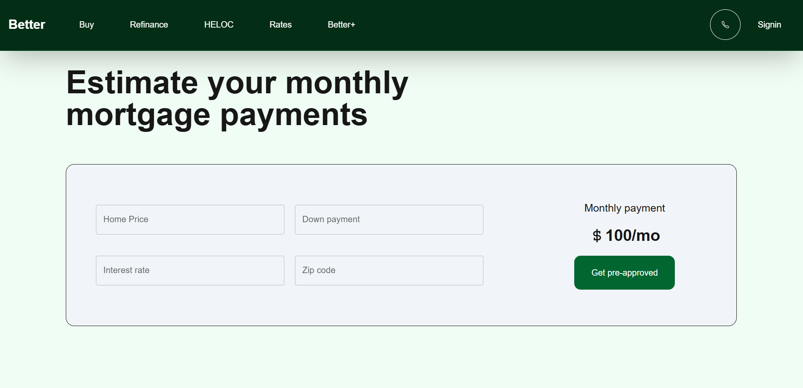
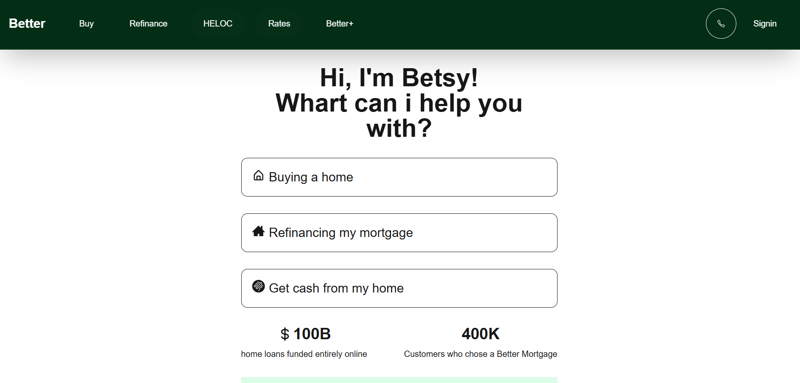

# 🚗 Better Assigment

A modern, Nextjs Better platform built with **Next.js**, **Tailwind**, **react-ico**.  


---

## 🌐 Live Demo
🔗 [Home](https://better-assignment-self.vercel.app)
🔗 [About-us](https://better-assignment-self.vercel.app/about-us)
🔗 [Calculator](https://better-assignment-self.vercel.app/mortgage-calculator)
🔗 [Start](https://better-assignment-self.vercel.app/start)

---

## 📸 Screenshots

### Homepage


### About-us


### Calculator Page


### Start page


---


## 🛠️ Tech Stack
**Frontend:** Next.js, Tailwind CSS, React Icons  

---

## 📦 Installation

### 1️⃣ Clone the repository
```bash
git clone https://github.com/warsi0707/Better-assignment

npm install

npm run dev
```

